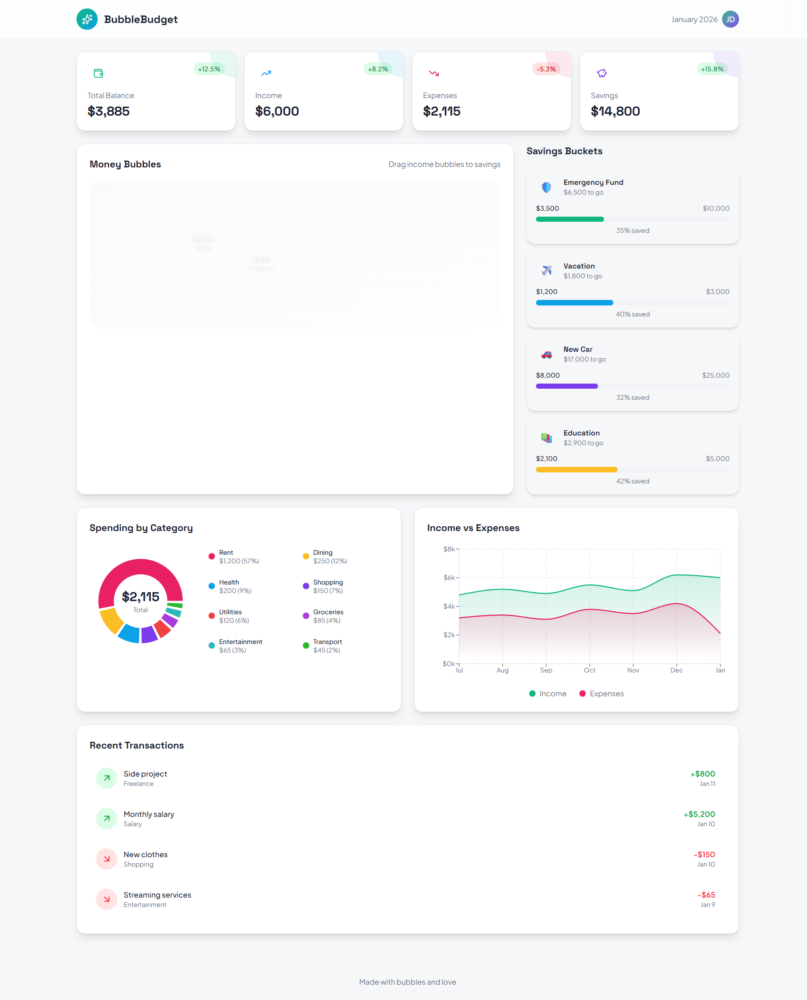
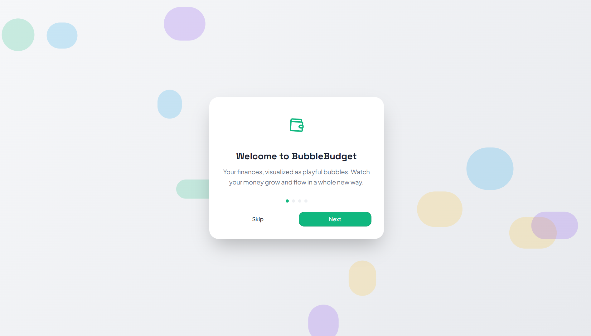
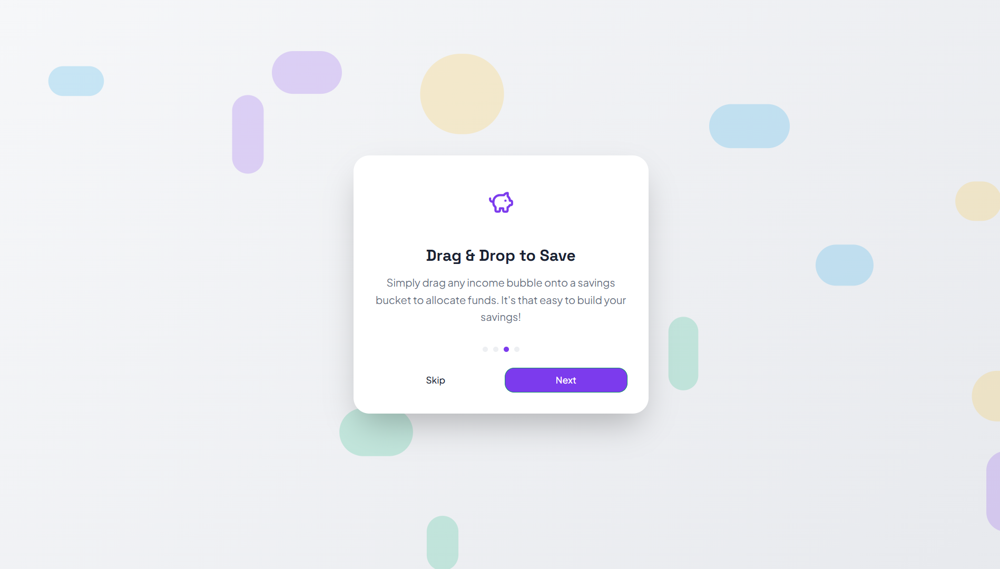

# Bubble Budget 💸

An **animated personal finance dashboard** that helps users visualize income, expenses, and savings using interactive bubble-based UI components.

🔗 **GitHub Repository:**  
https://github.com/Afsal-Palliyal/Bubble-Budget

---

## ✨ Features

- 📊 Interactive personal finance dashboard  
- 💰 Animated money bubbles for income & expenses  
- 🪣 Savings buckets visualization  
- ⚡ Fast, modern UI built with Vite + TypeScript  
- 🧩 Modular client–server architecture  

---

## 🛠️ Tech Stack

- **Frontend:** TypeScript, Vite, CSS  
- **Backend:** Node.js  
- **Database / ORM:** Drizzle  
- **Tooling:** Replit, GitHub  

---

## 📸 Screenshots

<table>
  <tr>
    <td align="center"><b>Dashboard</b></td>
    <td align="center"><b>Budget Bubbles</b></td>
  </tr>
  <tr>
    <td>
      
    </td>
    <td>
      
    </td>
  </tr>
  <tr>
    <td align="center"><b>Money</b></td>
    <td align="center"><b>Savings</b></td>
  </tr>
  <tr>
    <td>
      
    </td>
    <td>
      
    </td>
  </tr>
</table>

<br/>

<p align="center">
  <b>Progress View</b><br/>
  
</p>

---

## 📁 Project Structure

```text
Bubble-Budget/
├── client/        # Frontend application
├── server/        # Backend services
├── shared/        # Shared types & utilities
├── script/        # Setup / helper scripts
├── package.json
├── tsconfig.json
├── vite.config.ts
└── README.md

🚀 Getting Started (Local Setup)
1️⃣ Clone the repository
git clone https://github.com/Afsal-Palliyal/Bubble-Budget.git
cd Bubble-Budget

2️⃣ Install dependencies
npm install

3️⃣ Run the app
npm run dev
